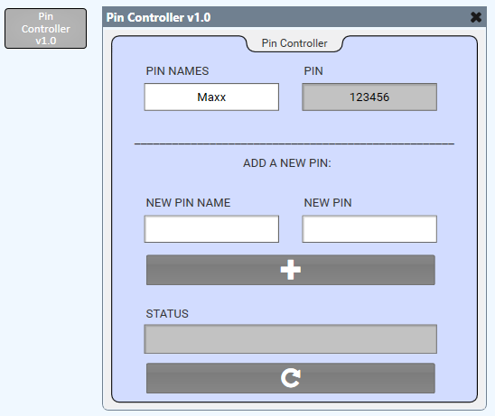

# Q-SYS Pin Controller

This is a simple plugin that allows you to get the UCI pins saved in Core Manager as well as add to them. It can be used to dynamically choose and create pins for custom UCI pin .

Click [here](https://qsc0-my.sharepoint.com/:f:/g/personal/maxx_sanner_qsc_com/Et-wbTXRAHNJo8E7bWF1dPEB0s9qz05b-AClicBFwiLEHg?e=mRLIYj) to download the plugin.

## How to Use

* Simply download the plugin and add it to your C:\Users\user\Documents\QSC\Q-Sys Designer\Plugins folder. 
* Drag into your schematic from the plugins section of your Schematic Elements. 
* Upon initialization, the PIN NAMES control will automatically be populated with all of the pin names that have been set up in Core Manager (in the User Control Interfaces tab).
* When a pin name is selected, the corresponding pin will populate in the "PIN" text field.
* You can also add new pins by entering a new pin name and pin and clicking the "+" button. This pin will be added to the list in Core Manager and the PIN NAMES combo box will be updated with the new pin.
* There is also a refresh button that can be used to re-get the data in case any changes happen in Core Manager.

## How it Works

This plugin uses the following Q-SYS extensions to Lua:
* HTTPClient - This is used to GET and POST pin data from and to the Core.
* RapidJSON - This is used to receive and send data as JSON.

The PIN NAMES and PIN fields are populated using an HTTP GET (HTTPClient.Download). Adding pins is done by doing an HTTP POST (HTTPClient.Upload) to the Core. 

## Badges 
 
 

## Questions 
 For any questions, contact me at [maxxsanner105@gmail.com](mailto:maxxsanner105@gmail.com).
#### 

